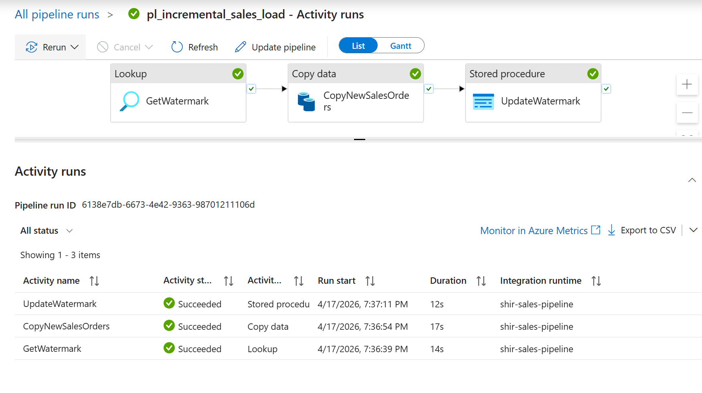
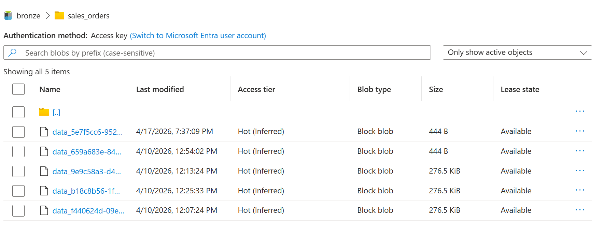
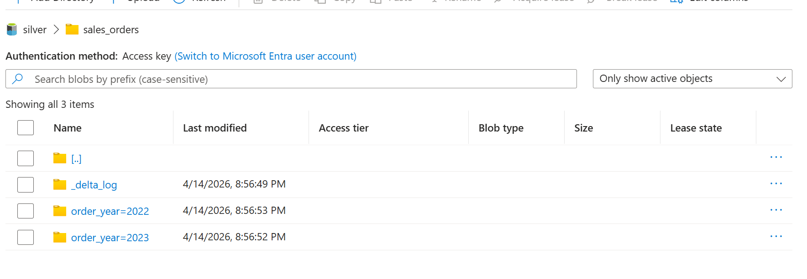
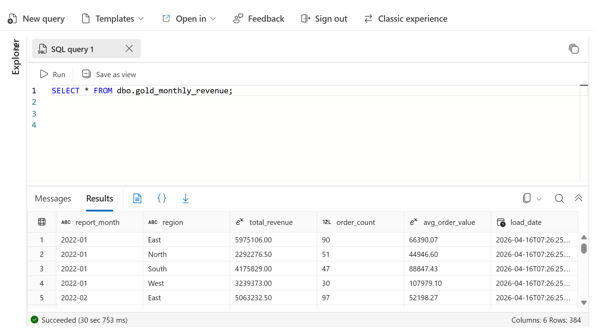
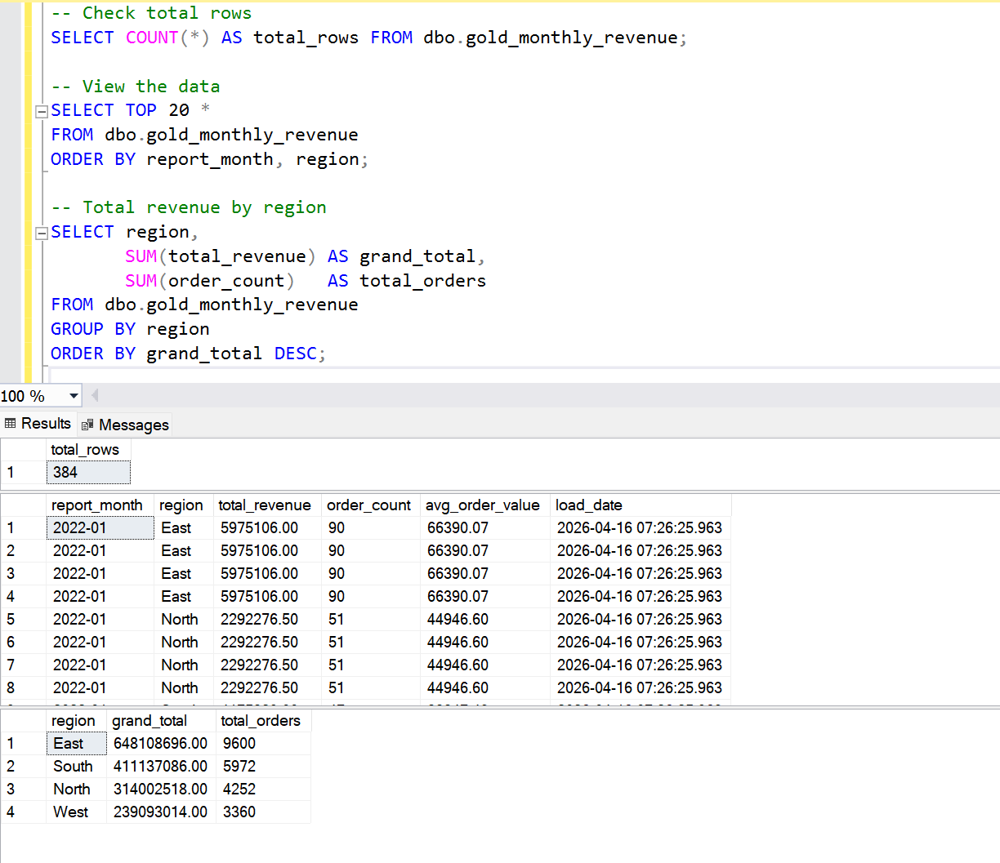

End-to-end Azure data pipeline that migrates on-premise SQL Server
sales data to Azure cloud, transforms it through medallion layers,
and writes business aggregations back for reporting.

---

## Architecture

```
MSSQL (10K orders)
    ↓  ADF incremental watermark pipeline
ADLS Gen2 — Bronze (raw parquet files)
    ↓  Databricks PySpark — data quality + transforms
ADLS Gen2 — Silver (cleaned Delta Lake, partitioned)
    ↓  Databricks Spark SQL — aggregations
ADLS Gen2 — Gold (Delta Lake — monthly revenue + top products)
    ↓  JDBC write-back
Azure SQL — reporting table (gold_monthly_revenue)
```

---

## Tech Stack

| Layer | Tool | Purpose |
|-------|------|---------|
| Source | SQL Server (MSSQL) | 10,000 sales orders, customers, products |
| Ingestion | Azure Data Factory | Incremental load using watermark pattern |
| Storage | ADLS Gen2 | bronze / silver / gold containers |
| Transform | Azure Databricks + PySpark | Data quality checks + ETL transforms |
| Format | Delta Lake | ACID transactions + year/month partitioning |
| Reporting | Azure SQL (JDBC) | Gold aggregations for business queries |
| Version control | GitHub | All notebooks and SQL scripts |

---

## What This Project Demonstrates

- **Incremental loading** — ADF watermark pattern loads only new rows each run
- **SHIR** — Self-Hosted Integration Runtime connects local SQL Server to Azure ADF
- **Data quality** — PySpark deduplication, null checks, value validation in silver layer
- **Delta Lake** — Partitioned by order_year/order_month for faster queries
- **Medallion architecture** — Bronze (raw) → Silver (clean) → Gold (aggregated)
- **JDBC write-back** — Gold results written to Azure SQL for downstream reporting

---

## Screenshots

### ADF Pipeline — Succeeded


### Bronze Files in ADLS Gen2


### Silver Delta Partitions in ADLS


### Gold Folders in ADLS


### Gold Data Result



---

## Project Structure

```
mssql-azure-data-pipeline/
├── SQL/
│   ├── 01_create_database.sql       # Create SalesDB + tables
│   ├── 02_insert_data.sql           # Insert 10K orders
│   └── 03_watermark_setup.sql       # Watermark table + stored procedure
├── Databricks_Notebooks/
│   ├── 01_configure_access.ipynb    # ADLS Gen2 connection setup
│   ├── 02_bronze_to_silver.ipynb    # PySpark clean + Delta Lake write
│   ├── 03_silver_to_gold.ipynb      # Aggregations — revenue + products
│   └── 04_gold_to_mssql.ipynb       # JDBC write-back to Azure SQL
├── Screenshots/
│   ├── 01_adf_pipeline_success.png
│   ├── 02_bronze_files_adls.png
│   ├── 03_silver_delta_adls.png
│   ├── 04_gold_folders_adls.png
│   ├── 05_gold_data_ssms.png
│   └── 06_notebook_output.png
└── README.md
```

---

## Pipeline Results

| Metric | Value |
|--------|-------|
| Source rows | 10,000 sales orders |
| ADF pipeline runs | 2 successful runs |
| Bronze files | 4 parquet files in ADLS |
| Silver rows (after quality checks) | ~10,000 (deduped) |
| Gold — monthly revenue rows | ~96 (24 months × 4 regions) |
| Gold — top products rows | 10 products ranked by revenue |

---

## How to Reproduce

1. Run SQL scripts in `SQL/` folder in SSMS in order (01 → 02 → 03)
2. Create Azure services: ADLS Gen2, Azure Data Factory, Azure Databricks
3. Install SHIR on local machine to connect SQL Server to ADF
4. Build ADF pipeline: Lookup → Copy Data → Stored Procedure (watermark pattern)
5. Run Databricks notebooks in order: 01 → 02 → 03 → 04

---

## Author

**Sravya Macharla** — Azure Data Engineer
[LinkedIn](https://linkedin.com/in/sravya-macharla) | [GitHub](https://github.com/sravyamacharla)


